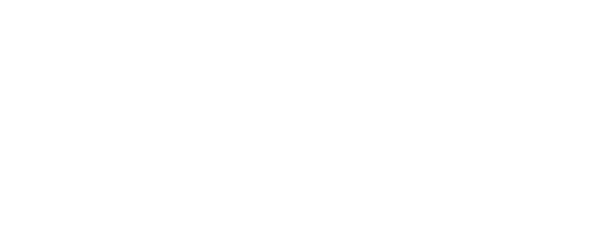
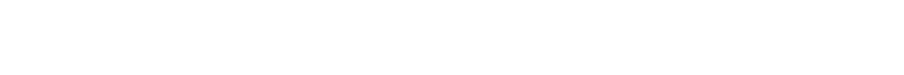
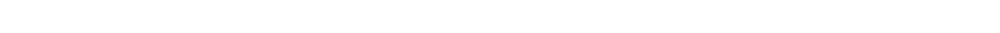
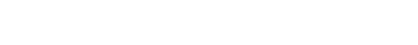
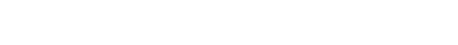
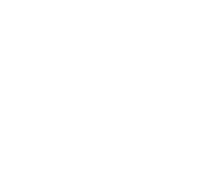
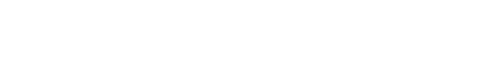

# Atwood Machine Simulation

A simple simulation of an Atwood machine achieved with [manim](github.com).

## Mathematical Background

We'll derivate the equations of motion with the aid of [Lagrangian mechanics](https://en.wikipedia.org/wiki/Lagrangian_mechanics)

atwood_image 1082
final_system 1170
lagrangian_equation 202
lagrangian_system 355
L_equation 1178
r 20
relation_equation 418
V_equation 1113
x_variable 458

  

Considering the pulley to have a radius   , we have

  

  

and the lagrangian will be

  

Notice the following relation

  

We can introduce a new variable such that

  

The Lagrangian theory will tell us that we have the following system describes the motion of system

  

Computing the partial derivative we arrive at the following system of differential equations

  

