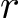
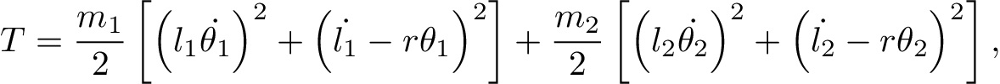
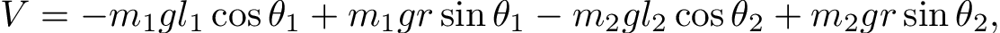
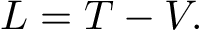
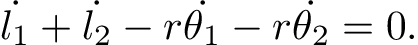
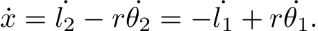
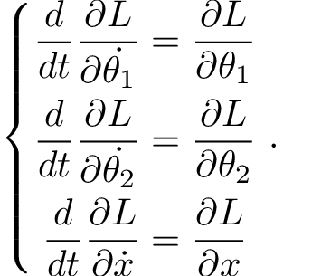
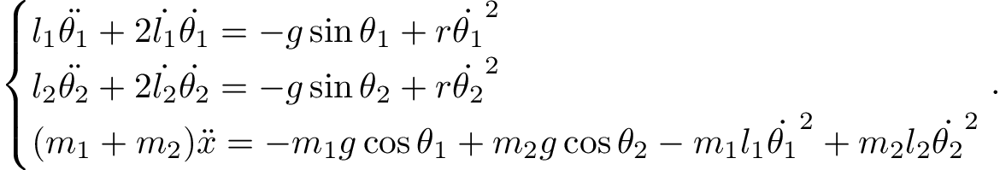

# Atwood Machine Simulation

A simple simulation of an Atwood machine achieved with [manim](github.com).

If you can't see the figures and/or the equations, please checkout the [dark theme version of this README](README.md).

  

## Mathematical Background

We'll derivate the equations of motion with the aid of [Lagrangian mechanics](https://en.wikipedia.org/wiki/Lagrangian_mechanics)

  

Considering that both pulleys have a radius equal to , we have

  

 

  

 

and the lagrangian will be

  

 

Notice the following relation

  

 

We can introduce a new variable such that

  

 

The Lagrangian theory tells us that the system of equations

  

 

describes the motion of all the particles in the system.

Computing the partial derivatives, we arrive at the following system of differential equations

  

 

This system of equations can be solved with the excellent [scipy](https://docs.scipy.org/doc/scipy/reference/) scientific computing library, and in this project, I am using the [odeint](https://docs.scipy.org/doc/scipy/reference/generated/scipy.integrate.odeint.html) function.
